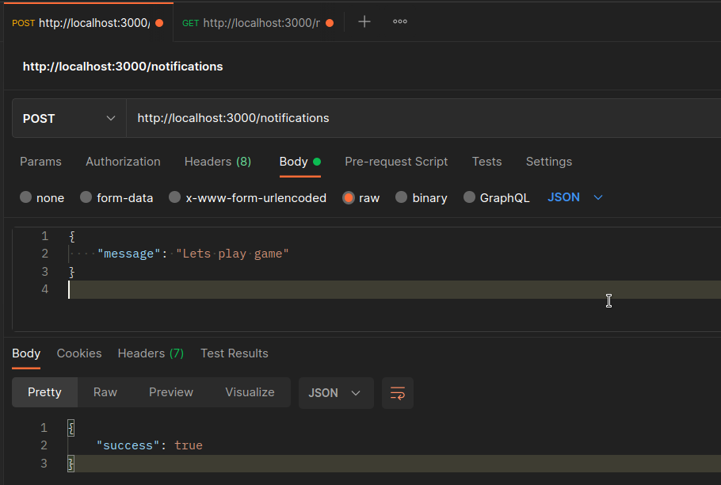
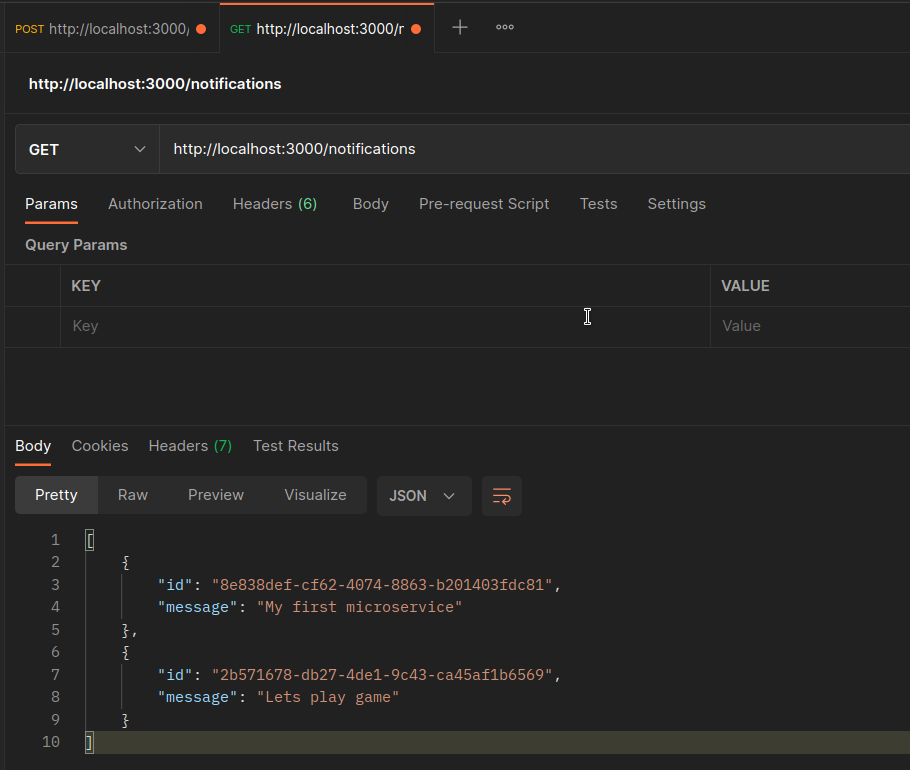

# Microservice

Testando a feature de microservice nestjs.
Este é um projeto simples com uma api cliente, um broker message e um microservice.
Existem apenas dois endpoints disponíveis. Um para criar uma mensagem e outro para obter todas as mensagens.

## Broker Based


### Como rodar esse projeto

**Requisitos para rodar este projeto**

- docker
- docker-compose
- nodejs v14+
- npm
- yarn
- build essentials
- linux, gitbash ou wsl

---

Existe um arquivo Makefile com todos os comandos necessários 

Primeiro instale as dependências

```sh

$ make install

```

Execute o projeto

```sh

$ make run

```

---

### Recursos do projeto

É possível criar uma mensagem com o endpoint 

`POST` criar uma mensagem

```sh

$ curl -X POST http://localhost:3000/notifications \
-H "Content-Type: application/json" \
-d '{ "message": "hello world" }' | jq '.'

```



---

`GET` listar todas as mensagens

```sh

$ curl http://localhost:3000/notifications | jq '.'

```

