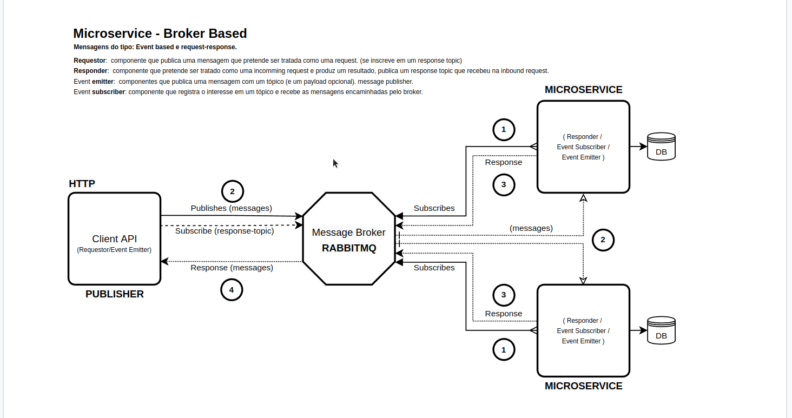

# Microservice

Testando a feature de microservice nestjs.
Este é um projeto simples com uma api cliente, um broker message e um microservice.
Existem apenas dois endpoints disponíveis. Um para criar uma mensagem e outro para obter todas as mensagens.

## Broker Based




### Como rodar esse projeto

**Requisitos para rodar este projeto**

- docker
- docker-compose
- nodejs v14+
- npm
- yarn
- build essentials
- linux, gitbash ou wsl

---

Existe um arquivo Makefile com todos os comandos necessários 

Primeiro instale as dependências

```sh

$ make install

```

Em seguida faça o build

```sh

$ make build

```

Execute o projeto

```sh

$ make start

```

Caso deseje ver os logs execute o comando

```sh

$ make logs

```

Para parar a aplicação basta executar

```sh

$ make stop

```

---

### Recursos do projeto

É possível criar uma mensagem com o endpoint 

`POST` criar uma mensagem

```sh

$ curl -X POST http://localhost:3000/gateway/buy \
-H "Content-Type: application/json" \
-d '{ "product": "my product", "price": 180 }' | jq '.'

```

---

`GET` listar todos os pagamentos

```sh

$ curl http://localhost:3000/gateway/payments | jq '.'

```

`GET` listar todos as notas

```sh

$ curl http://localhost:3000/gateway/invoices | jq '.'

```
